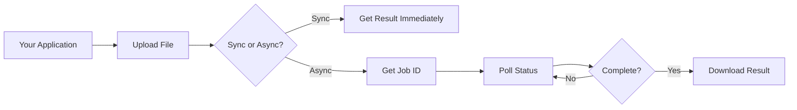

# Kernel API Integration Guide

## Overview
The Kernel API is a RESTful service for converting CAD files (STEP, BREP, IGES) to mesh formats (STL, OBJ, GLTF/GLB). This guide explains how to integrate the API into your software application.

## Table of Contents
- [Quick Start](#quick-start)
- [Integration Methods](#integration-methods)
- [Authentication](#authentication)
- [Error Handling](#error-handling)
- [Code Examples](#code-examples)
- [Best Practices](#best-practices)

## Quick Start

### API Base URL
```
http://your-server:8000/api/v1
```

### Basic Integration Flow


## Integration Methods

### Method 1: Synchronous Conversion (Simple Integration)
Best for: Small files (<50MB), immediate results needed

```python
import requests

def convert_cad_file(file_path, output_format='stl'):
    url = "http://localhost:8000/api/v1/convert"
    
    with open(file_path, 'rb') as f:
        files = {'file': f}
        data = {
            'output_format': output_format,
            'async_processing': 'false'
        }
        response = requests.post(url, files=files, data=data)
    
    if response.status_code == 200:
        result = response.json()
        # Download the converted file
        download_url = f"http://localhost:8000/api/v1/download/{result['job_id']}"
        return requests.get(download_url).content
    else:
        raise Exception(f"Conversion failed: {response.text}")
```

### Method 2: Asynchronous Conversion (Production Integration)
Best for: Large files, batch processing, non-blocking operations

```python
import requests
import time

class KernelAPIClient:
    def __init__(self, base_url="http://localhost:8000/api/v1"):
        self.base_url = base_url
    
    def start_conversion(self, file_path, output_format='stl', 
                         deflection=0.1, angular_deflection=0.5):
        """Start an async conversion job"""
        url = f"{self.base_url}/convert"
        
        with open(file_path, 'rb') as f:
            files = {'file': f}
            data = {
                'output_format': output_format,
                'deflection': deflection,
                'angular_deflection': angular_deflection,
                'async_processing': 'true'
            }
            response = requests.post(url, files=files, data=data)
        
        if response.status_code == 200:
            return response.json()['job_id']
        else:
            raise Exception(f"Failed to start conversion: {response.text}")
    
    def check_status(self, job_id):
        """Check conversion job status"""
        url = f"{self.base_url}/status/{job_id}"
        response = requests.get(url)
        return response.json()
    
    def download_result(self, job_id):
        """Download converted file"""
        url = f"{self.base_url}/download/{job_id}"
        response = requests.get(url)
        if response.status_code == 200:
            return response.content
        else:
            raise Exception(f"Download failed: {response.text}")
    
    def convert_with_polling(self, file_path, output_format='stl', 
                            poll_interval=2, timeout=300):
        """Complete conversion workflow with polling"""
        job_id = self.start_conversion(file_path, output_format)
        
        start_time = time.time()
        while time.time() - start_time < timeout:
            status = self.check_status(job_id)
            
            if status['status'] == 'completed':
                return self.download_result(job_id)
            elif status['status'] == 'failed':
                raise Exception(f"Conversion failed: {status.get('error')}")
            
            time.sleep(poll_interval)
        
        raise TimeoutError(f"Conversion timeout after {timeout} seconds")
```

## Authentication
Currently, the API does not require authentication. For production deployments, consider implementing:
- API Key authentication
- OAuth 2.0
- JWT tokens

## Error Handling

### HTTP Status Codes
- `200`: Success
- `400`: Bad request (invalid format, missing parameters)
- `404`: Job or file not found
- `413`: File too large
- `500`: Server error during conversion

### Error Response Format
```json
{
    "detail": "Error message describing what went wrong"
}
```

### Common Error Scenarios
```python
def handle_conversion_errors(response):
    if response.status_code == 413:
        print("File too large. Consider splitting or compressing.")
    elif response.status_code == 400:
        print("Invalid file format or parameters.")
    elif response.status_code == 500:
        print("Server error. The file might be corrupted or too complex.")
```

## Code Examples

### JavaScript/Node.js Integration
```javascript
const FormData = require('form-data');
const fs = require('fs');
const axios = require('axios');

class KernelAPIClient {
    constructor(baseUrl = 'http://localhost:8000/api/v1') {
        this.baseUrl = baseUrl;
    }

    async convertFile(filePath, outputFormat = 'stl') {
        const form = new FormData();
        form.append('file', fs.createReadStream(filePath));
        form.append('output_format', outputFormat);
        form.append('async_processing', 'false');

        try {
            const response = await axios.post(
                `${this.baseUrl}/convert`,
                form,
                { headers: form.getHeaders() }
            );

            if (response.data.status === 'completed') {
                // Download the file
                const downloadResponse = await axios.get(
                    `${this.baseUrl}/download/${response.data.job_id}`,
                    { responseType: 'arraybuffer' }
                );
                return downloadResponse.data;
            }
        } catch (error) {
            console.error('Conversion failed:', error.response?.data);
            throw error;
        }
    }
}
```

### C#/.NET Integration
```csharp
using System;
using System.IO;
using System.Net.Http;
using System.Threading.Tasks;
using Newtonsoft.Json;

public class KernelAPIClient
{
    private readonly HttpClient httpClient;
    private readonly string baseUrl;

    public KernelAPIClient(string baseUrl = "http://localhost:8000/api/v1")
    {
        this.baseUrl = baseUrl;
        this.httpClient = new HttpClient();
    }

    public async Task<byte[]> ConvertFileAsync(string filePath, string outputFormat = "stl")
    {
        using var form = new MultipartFormDataContent();
        using var fileStream = File.OpenRead(filePath);
        
        form.Add(new StreamContent(fileStream), "file", Path.GetFileName(filePath));
        form.Add(new StringContent(outputFormat), "output_format");
        form.Add(new StringContent("false"), "async_processing");

        var response = await httpClient.PostAsync($"{baseUrl}/convert", form);
        
        if (response.IsSuccessStatusCode)
        {
            var json = await response.Content.ReadAsStringAsync();
            dynamic result = JsonConvert.DeserializeObject(json);
            
            // Download the converted file
            var downloadResponse = await httpClient.GetAsync(
                $"{baseUrl}/download/{result.job_id}"
            );
            
            return await downloadResponse.Content.ReadAsByteArrayAsync();
        }
        
        throw new Exception($"Conversion failed: {response.StatusCode}");
    }
}
```

### cURL Command Line
```bash
# Synchronous conversion
curl -X POST "http://localhost:8000/api/v1/convert" \
  -F "file=@/path/to/your/file.step" \
  -F "output_format=stl" \
  -F "deflection=0.1" \
  -F "angular_deflection=0.5" \
  -F "async_processing=false" \
  -o converted_file.stl

# Asynchronous conversion
# Step 1: Start conversion
RESPONSE=$(curl -X POST "http://localhost:8000/api/v1/convert" \
  -F "file=@/path/to/your/file.step" \
  -F "output_format=stl" \
  -F "async_processing=true")

JOB_ID=$(echo $RESPONSE | jq -r '.job_id')

# Step 2: Check status
curl "http://localhost:8000/api/v1/status/$JOB_ID"

# Step 3: Download when complete
curl "http://localhost:8000/api/v1/download/$JOB_ID" -o result.stl
```

## Best Practices

### 1. File Size Management
```python
MAX_FILE_SIZE = 100 * 1024 * 1024  # 100MB

def check_file_size(file_path):
    size = os.path.getsize(file_path)
    if size > MAX_FILE_SIZE:
        # Use async processing for large files
        return True
    return False
```

### 2. Retry Logic
```python
import time
from typing import Optional

def convert_with_retry(client, file_path, max_retries=3):
    for attempt in range(max_retries):
        try:
            return client.convert_file(file_path)
        except Exception as e:
            if attempt < max_retries - 1:
                wait_time = 2 ** attempt  # Exponential backoff
                time.sleep(wait_time)
            else:
                raise
```

### 3. Progress Tracking
```python
def convert_with_progress(client, file_path, callback=None):
    job_id = client.start_conversion(file_path)
    
    while True:
        status = client.check_status(job_id)
        
        if callback:
            callback(status)  # Update UI, log, etc.
        
        if status['status'] == 'completed':
            return client.download_result(job_id)
        elif status['status'] == 'failed':
            raise Exception(status.get('error'))
        
        time.sleep(2)
```

### 4. Batch Processing
```python
from concurrent.futures import ThreadPoolExecutor, as_completed

def batch_convert(client, file_paths, max_workers=5):
    results = {}
    
    with ThreadPoolExecutor(max_workers=max_workers) as executor:
        future_to_file = {
            executor.submit(client.convert_with_polling, path): path 
            for path in file_paths
        }
        
        for future in as_completed(future_to_file):
            file_path = future_to_file[future]
            try:
                result = future.result()
                results[file_path] = {'status': 'success', 'data': result}
            except Exception as e:
                results[file_path] = {'status': 'failed', 'error': str(e)}
    
    return results
```

### 5. Caching Conversions
```python
import hashlib
import pickle

class CachedKernelClient(KernelAPIClient):
    def __init__(self, base_url, cache_dir="./cache"):
        super().__init__(base_url)
        self.cache_dir = cache_dir
        os.makedirs(cache_dir, exist_ok=True)
    
    def get_file_hash(self, file_path):
        with open(file_path, 'rb') as f:
            return hashlib.sha256(f.read()).hexdigest()
    
    def convert_with_cache(self, file_path, output_format='stl'):
        file_hash = self.get_file_hash(file_path)
        cache_path = os.path.join(self.cache_dir, f"{file_hash}_{output_format}")
        
        if os.path.exists(cache_path):
            with open(cache_path, 'rb') as f:
                return f.read()
        
        result = self.convert_with_polling(file_path, output_format)
        
        with open(cache_path, 'wb') as f:
            f.write(result)
        
        return result
```

## WebSocket Integration (Future)
For real-time status updates, consider implementing WebSocket support:

```javascript
const ws = new WebSocket('ws://localhost:8000/ws');

ws.on('message', (data) => {
    const update = JSON.parse(data);
    if (update.type === 'status_update') {
        updateProgressBar(update.progress);
    }
});
```

## Rate Limiting
If implementing rate limiting, handle 429 responses:

```python
def handle_rate_limit(response):
    if response.status_code == 429:
        retry_after = int(response.headers.get('Retry-After', 60))
        time.sleep(retry_after)
        return True
    return False
```

## Monitoring and Logging
```python
import logging

logging.basicConfig(level=logging.INFO)
logger = logging.getLogger(__name__)

class MonitoredKernelClient(KernelAPIClient):
    def start_conversion(self, file_path, output_format='stl', **kwargs):
        logger.info(f"Starting conversion: {file_path} -> {output_format}")
        start_time = time.time()
        
        try:
            result = super().start_conversion(file_path, output_format, **kwargs)
            logger.info(f"Conversion started: job_id={result}")
            return result
        except Exception as e:
            logger.error(f"Conversion failed: {e}")
            raise
        finally:
            duration = time.time() - start_time
            logger.info(f"Request took {duration:.2f} seconds")
```

## Deployment Considerations

### Docker Deployment
```yaml
# docker-compose.yml for your application
version: '3.8'

services:
  your-app:
    build: .
    environment:
      - KERNEL_API_URL=http://kernel-api:8000/api/v1
    depends_on:
      - kernel-api
  
  kernel-api:
    image: kernel-api:latest
    ports:
      - "8000:8000"
    volumes:
      - ./uploads:/app/uploads
      - ./outputs:/app/outputs
```

### Kubernetes Deployment
```yaml
apiVersion: v1
kind: Service
metadata:
  name: kernel-api
spec:
  selector:
    app: kernel-api
  ports:
    - port: 8000
      targetPort: 8000
---
apiVersion: apps/v1
kind: Deployment
metadata:
  name: kernel-api
spec:
  replicas: 3
  selector:
    matchLabels:
      app: kernel-api
  template:
    metadata:
      labels:
        app: kernel-api
    spec:
      containers:
      - name: kernel-api
        image: kernel-api:latest
        ports:
        - containerPort: 8000
```

## Support Matrix

| Your Platform | Recommended Integration |
|--------------|------------------------|
| Python Application | Native requests library |
| Node.js/JavaScript | Axios or Fetch API |
| .NET/C# | HttpClient |
| Java | Apache HttpClient |
| Mobile (iOS/Android) | REST client libraries |
| Embedded Systems | libcurl |
| Web Browser | Fetch API with CORS |

## Troubleshooting

### Common Issues and Solutions

1. **Connection Refused**
   - Check if API is running: `curl http://localhost:8000/health`
   - Verify firewall settings
   - Check Docker container status

2. **File Format Not Supported**
   - Verify file extension is correct
   - Check supported formats: `/api/v1/formats`

3. **Conversion Timeout**
   - Increase timeout values
   - Use async processing for large files
   - Check server resources

4. **Memory Issues**
   - Limit concurrent conversions
   - Implement file size checks
   - Use streaming for large files

## Additional Resources
- [API Reference](./API_REFERENCE.md)
- [Use Cases Guide](./USE_CASES.md)
- [Performance Tuning](./PERFORMANCE.md)
- [Security Guide](./SECURITY.md)