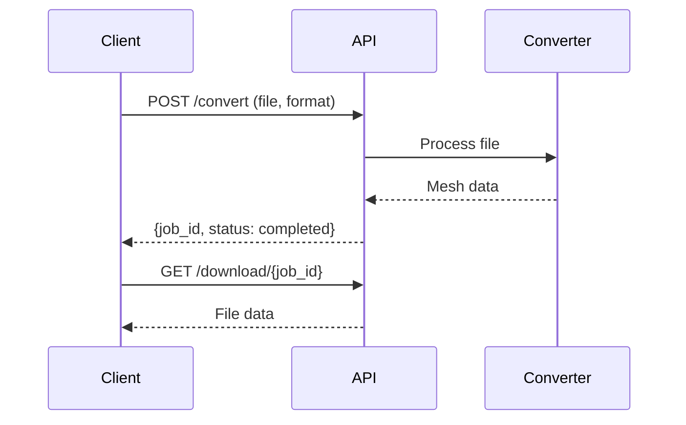
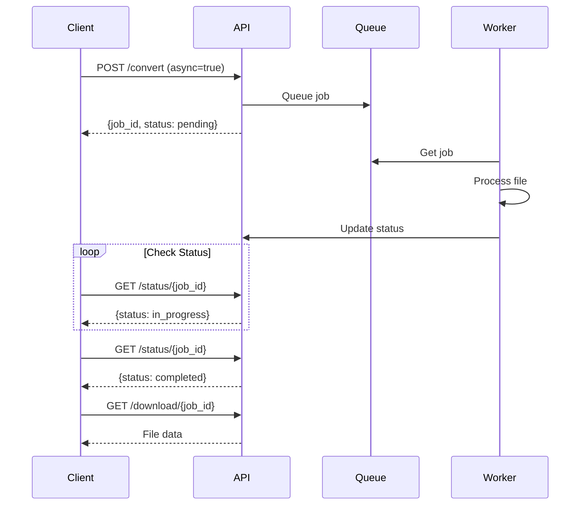

# Kernel API Reference

## Base Information

### Base URL
```
http://{host}:8000/api/v1
```

### Content Types
- **Request**: `multipart/form-data` for file uploads, `application/json` for other requests
- **Response**: `application/json` for metadata, `application/octet-stream` for file downloads

### Rate Limits
- Default: No rate limiting
- Configurable via environment variables

## Endpoints

### 1. Convert File

Converts a CAD file to a mesh format.

#### Endpoint
```
POST /api/v1/convert
```

#### Request Parameters

| Parameter | Type | Required | Default | Description |
|-----------|------|----------|---------|-------------|
| `file` | File | Yes | - | The CAD file to convert (STEP, IGES, BREP, STL) |
| `output_format` | string | No | "stl" | Target format: "stl", "obj", "gltf", "glb" |
| `deflection` | float | No | 0.1 | Surface deviation tolerance (0.001-1.0) |
| `angular_deflection` | float | No | 0.5 | Angular deviation in radians (0.1-1.0) |
| `async_processing` | boolean | No | false | Process asynchronously |

#### Response

##### Synchronous (async_processing=false)
```json
{
    "job_id": "550e8400-e29b-41d4-a716-446655440000",
    "status": "completed",
    "output_file": "/outputs/550e8400-e29b-41d4-a716-446655440000_model.stl",
    "message": "Conversion completed successfully"
}
```

##### Asynchronous (async_processing=true)
```json
{
    "job_id": "550e8400-e29b-41d4-a716-446655440000",
    "status": "pending",
    "message": "Conversion job queued for processing"
}
```

#### Status Codes
- `200 OK`: Request successful
- `400 Bad Request`: Invalid parameters or unsupported format
- `413 Payload Too Large`: File exceeds size limit
- `500 Internal Server Error`: Conversion failed

#### Example Request

##### cURL
```bash
curl -X POST "http://localhost:8000/api/v1/convert" \
  -F "file=@model.step" \
  -F "output_format=stl" \
  -F "deflection=0.05" \
  -F "angular_deflection=0.3" \
  -F "async_processing=false"
```

##### Python
```python
import requests

url = "http://localhost:8000/api/v1/convert"
files = {'file': open('model.step', 'rb')}
data = {
    'output_format': 'stl',
    'deflection': 0.05,
    'angular_deflection': 0.3,
    'async_processing': False
}

response = requests.post(url, files=files, data=data)
print(response.json())
```

##### JavaScript
```javascript
const formData = new FormData();
formData.append('file', fileInput.files[0]);
formData.append('output_format', 'stl');
formData.append('deflection', '0.05');
formData.append('angular_deflection', '0.3');
formData.append('async_processing', 'false');

fetch('http://localhost:8000/api/v1/convert', {
    method: 'POST',
    body: formData
})
.then(response => response.json())
.then(data => console.log(data));
```

---

### 2. Get Conversion Status

Check the status of an asynchronous conversion job.

#### Endpoint
```
GET /api/v1/status/{job_id}
```

#### Path Parameters

| Parameter | Type | Required | Description |
|-----------|------|----------|-------------|
| `job_id` | string | Yes | The unique job identifier |

#### Response

```json
{
    "job_id": "550e8400-e29b-41d4-a716-446655440000",
    "status": "in_progress",
    "message": "Processing file...",
    "output_file": null,
    "error": null
}
```

#### Status Values
- `pending`: Job is queued
- `in_progress`: Currently processing
- `completed`: Successfully finished
- `failed`: Conversion failed

#### Status Codes
- `200 OK`: Status retrieved
- `404 Not Found`: Job ID not found

#### Example Request

##### cURL
```bash
curl "http://localhost:8000/api/v1/status/550e8400-e29b-41d4-a716-446655440000"
```

##### Python
```python
import requests

job_id = "550e8400-e29b-41d4-a716-446655440000"
response = requests.get(f"http://localhost:8000/api/v1/status/{job_id}")
print(response.json())
```

---

### 3. Download Converted File

Download the result of a completed conversion.

#### Endpoint
```
GET /api/v1/download/{job_id}
```

#### Path Parameters

| Parameter | Type | Required | Description |
|-----------|------|----------|-------------|
| `job_id` | string | Yes | The unique job identifier |

#### Response
- **Content-Type**: `application/octet-stream`
- **Body**: Binary file data

#### Status Codes
- `200 OK`: File download starts
- `400 Bad Request`: Job not completed
- `404 Not Found`: Job ID or file not found

#### Example Request

##### cURL
```bash
curl "http://localhost:8000/api/v1/download/550e8400-e29b-41d4-a716-446655440000" \
  --output converted_model.stl
```

##### Python
```python
import requests

job_id = "550e8400-e29b-41d4-a716-446655440000"
response = requests.get(f"http://localhost:8000/api/v1/download/{job_id}")

with open('converted_model.stl', 'wb') as f:
    f.write(response.content)
```

---

### 4. Get Supported Formats

List all supported input and output formats.

#### Endpoint
```
GET /api/v1/formats
```

#### Response

```json
{
    "input_formats": ["step", "stp", "iges", "igs", "brep", "brp", "stl"],
    "output_formats": ["stl", "obj", "gltf", "glb"]
}
```

#### Status Codes
- `200 OK`: Formats retrieved

#### Example Request

##### cURL
```bash
curl "http://localhost:8000/api/v1/formats"
```

---

### 5. Health Check

Check if the API service is running.

#### Endpoint
```
GET /api/v1/health
```

#### Response

```json
{
    "status": "healthy",
    "version": "1.0.0",
    "timestamp": "2024-01-15T10:30:00Z"
}
```

#### Status Codes
- `200 OK`: Service is healthy
- `503 Service Unavailable`: Service is unhealthy

#### Example Request

##### cURL
```bash
curl "http://localhost:8000/api/v1/health"
```

---

## Data Models

### ConversionStatus Enum
```python
class ConversionStatus(str, Enum):
    PENDING = "pending"
    IN_PROGRESS = "in_progress"
    COMPLETED = "completed"
    FAILED = "failed"
```

### ConversionResponse Schema
```json
{
    "job_id": "string",
    "status": "ConversionStatus",
    "message": "string (optional)",
    "output_file": "string (optional)",
    "error": "string (optional)"
}
```

---

## Error Responses

All error responses follow this format:

```json
{
    "detail": "Error message describing what went wrong"
}
```

### Common Error Messages

| Error | Status Code | Message |
|-------|-------------|---------|
| File too large | 413 | "File size exceeds maximum allowed size of {max_size} bytes" |
| Invalid format | 400 | "Unsupported input format: {format}" |
| Invalid output | 400 | "Unsupported output format: {format}" |
| Job not found | 404 | "Job not found" |
| Conversion failed | 500 | "Conversion failed: {error_details}" |

---

## Configuration Options

### Environment Variables

| Variable | Default | Description |
|----------|---------|-------------|
| `MAX_UPLOAD_SIZE` | 104857600 (100MB) | Maximum file size in bytes |
| `DEFAULT_DEFLECTION` | 0.1 | Default surface deflection |
| `DEFAULT_ANGULAR_DEFLECTION` | 0.5 | Default angular deflection |
| `UPLOAD_DIR` | "./uploads" | Directory for uploaded files |
| `OUTPUT_DIR` | "./outputs" | Directory for converted files |
| `CLEANUP_INTERVAL` | 3600 | Seconds between cleanup runs |
| `FILE_RETENTION_TIME` | 86400 | Seconds to keep files |

---

## Quality Settings Guide

### Deflection Parameter

Controls the maximum distance between the original CAD surface and the tessellated mesh.

| Value | Quality | Use Case | Triangle Count |
|-------|---------|----------|----------------|
| 0.5-1.0 | Draft | Quick previews | Low |
| 0.1-0.5 | Medium | General viewing | Medium |
| 0.01-0.1 | High | Detailed inspection | High |
| 0.001-0.01 | Ultra | Manufacturing/Analysis | Very High |

### Angular Deflection Parameter

Controls the maximum angle between adjacent mesh faces.

| Value | Quality | Effect |
|-------|---------|--------|
| 0.8-1.0 | Low | Visible faceting on curves |
| 0.3-0.8 | Medium | Smooth appearance for most uses |
| 0.1-0.3 | High | Very smooth curves |
| 0.01-0.1 | Ultra | Nearly perfect curve representation |

---

## Workflow Examples

### Synchronous Conversion Workflow



### Asynchronous Conversion Workflow



---

## Client Libraries

### Python Client Example

```python
class KernelAPIClient:
    def __init__(self, base_url="http://localhost:8000/api/v1"):
        self.base_url = base_url
        
    def convert(self, file_path, output_format='stl', **kwargs):
        """Convert a CAD file"""
        url = f"{self.base_url}/convert"
        
        with open(file_path, 'rb') as f:
            files = {'file': f}
            data = {'output_format': output_format, **kwargs}
            response = requests.post(url, files=files, data=data)
        
        if response.status_code == 200:
            result = response.json()
            if result['status'] == 'completed':
                return self.download(result['job_id'])
            else:
                return self.wait_for_completion(result['job_id'])
        else:
            raise Exception(f"Conversion failed: {response.text}")
    
    def wait_for_completion(self, job_id, timeout=300):
        """Wait for async job to complete"""
        start = time.time()
        while time.time() - start < timeout:
            status = self.get_status(job_id)
            if status['status'] == 'completed':
                return self.download(job_id)
            elif status['status'] == 'failed':
                raise Exception(f"Conversion failed: {status.get('error')}")
            time.sleep(2)
        raise TimeoutError("Conversion timeout")
    
    def get_status(self, job_id):
        """Check job status"""
        response = requests.get(f"{self.base_url}/status/{job_id}")
        return response.json()
    
    def download(self, job_id):
        """Download converted file"""
        response = requests.get(f"{self.base_url}/download/{job_id}")
        return response.content
```

### TypeScript Client Example

```typescript
class KernelAPIClient {
    private baseUrl: string;
    
    constructor(baseUrl: string = "http://localhost:8000/api/v1") {
        this.baseUrl = baseUrl;
    }
    
    async convert(
        file: File,
        outputFormat: string = 'stl',
        options: ConversionOptions = {}
    ): Promise<Blob> {
        const formData = new FormData();
        formData.append('file', file);
        formData.append('output_format', outputFormat);
        
        Object.entries(options).forEach(([key, value]) => {
            formData.append(key, String(value));
        });
        
        const response = await fetch(`${this.baseUrl}/convert`, {
            method: 'POST',
            body: formData
        });
        
        const result = await response.json();
        
        if (result.status === 'completed') {
            return this.download(result.job_id);
        } else {
            return this.waitForCompletion(result.job_id);
        }
    }
    
    async waitForCompletion(jobId: string, timeout: number = 300000): Promise<Blob> {
        const startTime = Date.now();
        
        while (Date.now() - startTime < timeout) {
            const status = await this.getStatus(jobId);
            
            if (status.status === 'completed') {
                return this.download(jobId);
            } else if (status.status === 'failed') {
                throw new Error(`Conversion failed: ${status.error}`);
            }
            
            await new Promise(resolve => setTimeout(resolve, 2000));
        }
        
        throw new Error('Conversion timeout');
    }
    
    async getStatus(jobId: string): Promise<ConversionStatus> {
        const response = await fetch(`${this.baseUrl}/status/${jobId}`);
        return response.json();
    }
    
    async download(jobId: string): Promise<Blob> {
        const response = await fetch(`${this.baseUrl}/download/${jobId}`);
        return response.blob();
    }
}

interface ConversionOptions {
    deflection?: number;
    angular_deflection?: number;
    async_processing?: boolean;
}

interface ConversionStatus {
    job_id: string;
    status: 'pending' | 'in_progress' | 'completed' | 'failed';
    message?: string;
    output_file?: string;
    error?: string;
}
```

---

## Testing

### Test Files
Sample CAD files for testing are available at:
- https://www.cad-resources.com/free-cad-models/
- https://grabcad.com/library

### Basic Test Script

```bash
#!/bin/bash

# Test health check
curl http://localhost:8000/api/v1/health

# Test format listing
curl http://localhost:8000/api/v1/formats

# Test synchronous conversion
curl -X POST http://localhost:8000/api/v1/convert \
  -F "file=@test.step" \
  -F "output_format=stl" \
  -F "async_processing=false" \
  -o result.json

# Extract job_id and download
JOB_ID=$(cat result.json | jq -r '.job_id')
curl http://localhost:8000/api/v1/download/$JOB_ID -o output.stl

# Test async conversion
RESPONSE=$(curl -X POST http://localhost:8000/api/v1/convert \
  -F "file=@test.step" \
  -F "output_format=obj" \
  -F "async_processing=true")

JOB_ID=$(echo $RESPONSE | jq -r '.job_id')

# Poll status
while true; do
    STATUS=$(curl http://localhost:8000/api/v1/status/$JOB_ID | jq -r '.status')
    echo "Status: $STATUS"
    
    if [ "$STATUS" = "completed" ]; then
        curl http://localhost:8000/api/v1/download/$JOB_ID -o output.obj
        break
    elif [ "$STATUS" = "failed" ]; then
        echo "Conversion failed"
        break
    fi
    
    sleep 2
done
```

---

## Performance Metrics

### Expected Processing Times

| File Size | Simple Geometry | Complex Geometry |
|-----------|-----------------|------------------|
| < 1 MB | 1-3 seconds | 3-10 seconds |
| 1-10 MB | 3-10 seconds | 10-30 seconds |
| 10-50 MB | 10-30 seconds | 30-120 seconds |
| 50-100 MB | 30-60 seconds | 2-5 minutes |

### Optimization Tips

1. **Use appropriate quality settings**: Don't use ultra-high quality for previews
2. **Implement caching**: Cache frequently converted files
3. **Use async for large files**: Files > 10MB should use async processing
4. **Batch similar files**: Process files with similar settings together
5. **Monitor server resources**: Scale based on CPU and memory usage

---

## Troubleshooting

### Common Issues

| Issue | Possible Cause | Solution |
|-------|---------------|----------|
| 413 Error | File too large | Increase MAX_UPLOAD_SIZE or split file |
| 500 Error | Corrupted file | Validate CAD file in native software |
| Slow conversion | High quality settings | Reduce deflection parameters |
| Missing features | Unsupported CAD features | Check documentation for limitations |
| Connection timeout | Large file + sync mode | Use async processing |

### Debug Mode

Enable debug logging:

```python
# Set in environment
DEBUG=true
LOG_LEVEL=DEBUG
```

### Health Monitoring

```python
import requests
import time

def monitor_api_health(url, interval=60):
    while True:
        try:
            response = requests.get(f"{url}/health")
            if response.status_code == 200:
                print(f"✓ API healthy: {response.json()}")
            else:
                print(f"✗ API unhealthy: {response.status_code}")
        except Exception as e:
            print(f"✗ API unreachable: {e}")
        
        time.sleep(interval)
```

---

## Security Considerations

### File Upload Security
- Validate file extensions
- Check file headers (magic numbers)
- Scan for malware (optional integration)
- Enforce size limits

### API Security
- Implement rate limiting for production
- Add authentication (API keys, OAuth)
- Use HTTPS in production
- Validate all input parameters

### Example Security Headers
```python
# Recommended security headers
headers = {
    'X-Content-Type-Options': 'nosniff',
    'X-Frame-Options': 'DENY',
    'X-XSS-Protection': '1; mode=block',
    'Strict-Transport-Security': 'max-age=31536000'
}
```

---

## Version History

### v1.0.0 (Current)
- Initial release
- Support for STEP, IGES, BREP input
- Support for STL, OBJ, GLTF output
- Synchronous and asynchronous processing
- Quality control parameters

### Planned Features (v2.0.0)
- WebSocket support for real-time updates
- Batch processing endpoint
- Material and color preservation
- Assembly structure preservation
- Additional output formats (FBX, PLY, 3MF)