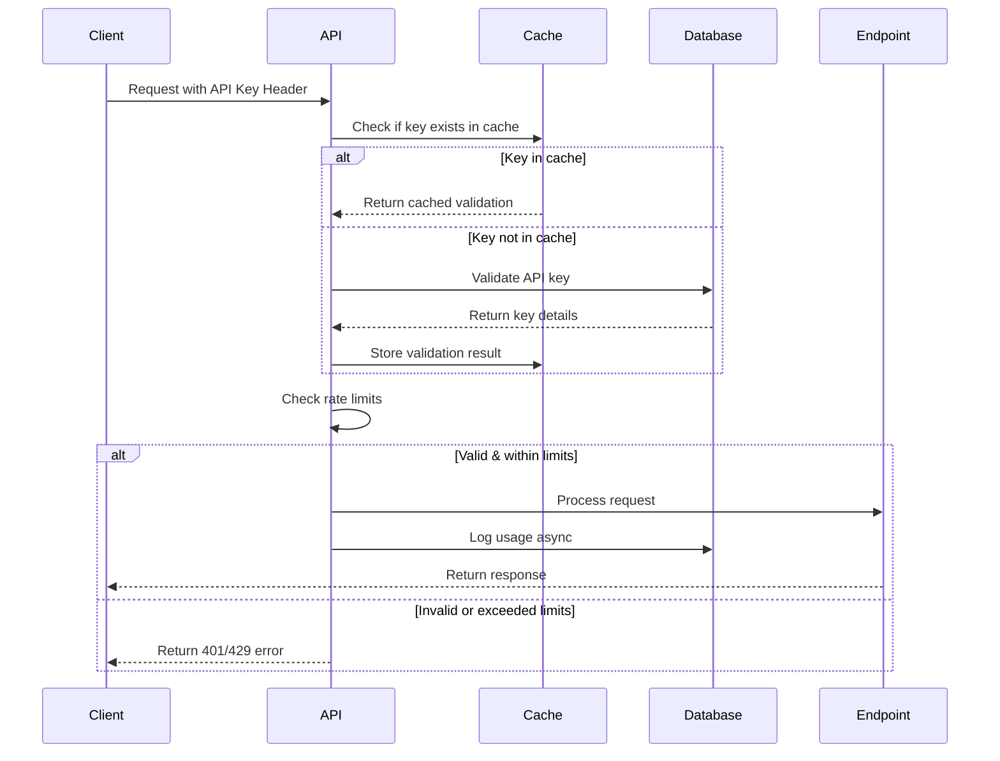

# API Key Authentication Planning

## Overview
Implement a basic API key-based authentication system for the Kernel API to control access to conversion endpoints and track usage per client.

## Requirements

### Core Features
1. **API Key Generation & Management**
   - Generate unique API keys for clients
   - Store keys securely (hashed)
   - Enable/disable keys
   - Set expiration dates (optional)

2. **Authentication Middleware**
   - Validate API keys on protected endpoints
   - Extract key from request headers
   - Cache validation results for performance

3. **Usage Tracking**
   - Track requests per API key
   - Monitor conversion count and data volume
   - Rate limiting per key (optional)

4. **Admin Interface**
   - Create/revoke API keys
   - View usage statistics
   - Configure key permissions

## Technical Design

### Database Schema

```sql
-- API Keys table
CREATE TABLE api_keys (
    id UUID PRIMARY KEY DEFAULT gen_random_uuid(),
    key_hash VARCHAR(255) NOT NULL UNIQUE,
    key_prefix VARCHAR(10) NOT NULL,  -- First 8 chars for identification
    name VARCHAR(255) NOT NULL,
    description TEXT,
    created_at TIMESTAMP DEFAULT NOW(),
    expires_at TIMESTAMP,
    is_active BOOLEAN DEFAULT TRUE,
    created_by VARCHAR(255),
    metadata JSONB
);

-- Usage tracking table
CREATE TABLE api_key_usage (
    id UUID PRIMARY KEY DEFAULT gen_random_uuid(),
    api_key_id UUID REFERENCES api_keys(id),
    endpoint VARCHAR(255) NOT NULL,
    method VARCHAR(10) NOT NULL,
    status_code INTEGER,
    request_size_bytes BIGINT,
    response_size_bytes BIGINT,
    processing_time_ms INTEGER,
    ip_address VARCHAR(45),
    user_agent TEXT,
    created_at TIMESTAMP DEFAULT NOW()
);

-- Rate limiting table (optional)
CREATE TABLE api_key_rate_limits (
    api_key_id UUID PRIMARY KEY REFERENCES api_keys(id),
    requests_per_minute INTEGER DEFAULT 60,
    requests_per_hour INTEGER DEFAULT 1000,
    requests_per_day INTEGER DEFAULT 10000,
    max_file_size_mb INTEGER DEFAULT 100,
    max_concurrent_jobs INTEGER DEFAULT 5
);
```

### API Key Format
- Format: `kapi_<environment>_<random_string>`
- Example: `kapi_prod_xK8s9Lm2nP4qR7tV3wY6zB1cD5fG8hJ`
- Length: 40 characters
- Environment prefixes:
  - `kapi_prod_` - Production
  - `kapi_test_` - Testing
  - `kapi_dev_` - Development

### Authentication Flow



## Implementation Plan

### Phase 1: Core Authentication (Week 1)
1. **Database Setup**
   - Add PostgreSQL or SQLite for persistence
   - Create migrations for schema
   - Set up connection pooling

2. **Key Management Service**
   ```python
   # app/services/auth/api_key_service.py
   class APIKeyService:
       def generate_key() -> str
       def create_key(name: str, description: str) -> APIKey
       def validate_key(key: str) -> bool
       def revoke_key(key_id: str) -> bool
       def get_key_details(key_prefix: str) -> APIKey
   ```

3. **Authentication Middleware**
   ```python
   # app/middleware/auth.py
   async def api_key_auth(request: Request):
       key = request.headers.get("X-API-Key")
       if not key:
           raise HTTPException(401, "API key required")
       
       if not await validate_api_key(key):
           raise HTTPException(401, "Invalid API key")
   ```

### Phase 2: Usage Tracking (Week 2)
1. **Async Usage Logger**
   - Background task for logging requests
   - Batch inserts for performance
   - Cleanup old logs periodically

2. **Statistics Endpoints**
   ```python
   GET /api/v1/admin/keys/{key_id}/stats
   GET /api/v1/admin/usage/summary
   ```

3. **Rate Limiting**
   - Redis-based rate limiting
   - Sliding window algorithm
   - Custom limits per key

### Phase 3: Management Interface (Week 3)
1. **Admin API Endpoints**
   ```python
   POST   /api/v1/admin/keys          # Create new key
   GET    /api/v1/admin/keys          # List all keys
   GET    /api/v1/admin/keys/{id}     # Get key details
   PATCH  /api/v1/admin/keys/{id}     # Update key
   DELETE /api/v1/admin/keys/{id}     # Revoke key
   ```

2. **Simple Web Dashboard** (Optional)
   - Key management UI
   - Usage analytics
   - Real-time monitoring

## Security Considerations

1. **Key Storage**
   - Store only hashed versions (bcrypt/argon2)
   - Never log full API keys
   - Secure key generation (cryptographically random)

2. **Transport Security**
   - Require HTTPS in production
   - Add request signing for sensitive operations (optional)

3. **Access Control**
   - Separate admin endpoints
   - Admin API keys with elevated permissions
   - IP whitelisting for admin access (optional)

4. **Audit Logging**
   - Log all key management operations
   - Track failed authentication attempts
   - Monitor for suspicious patterns

## Configuration

```python
# app/core/config.py additions
class AuthSettings(BaseSettings):
    ENABLE_AUTH: bool = True
    API_KEY_HEADER: str = "X-API-Key"
    API_KEY_PREFIX: str = "kapi"
    API_KEY_LENGTH: int = 32
    
    # Cache settings
    KEY_CACHE_TTL: int = 300  # 5 minutes
    
    # Rate limiting defaults
    DEFAULT_RATE_LIMIT_PER_MINUTE: int = 60
    DEFAULT_RATE_LIMIT_PER_HOUR: int = 1000
    
    # Database
    DATABASE_URL: str = "sqlite:///./kernel_api.db"
    
    # Admin settings
    ADMIN_API_KEY: str  # From environment
    REQUIRE_AUTH_FOR_HEALTH: bool = False
```

## Migration Strategy

1. **Backward Compatibility**
   - Start with auth disabled by default
   - Allow gradual rollout with feature flag
   - Support both authenticated and open endpoints initially

2. **Existing Users**
   - Generate keys for existing users if applicable
   - Provide migration period with warnings
   - Document changes clearly

## Testing Strategy

1. **Unit Tests**
   - Key generation and validation
   - Rate limiting logic
   - Database operations

2. **Integration Tests**
   - Full authentication flow
   - Rate limit enforcement
   - Usage tracking accuracy

3. **Load Tests**
   - Cache performance
   - Database query optimization
   - Rate limiter under load

## Monitoring & Alerts

1. **Metrics to Track**
   - Authentication success/failure rates
   - Average validation time
   - Cache hit rates
   - Rate limit violations

2. **Alerts**
   - High authentication failure rate
   - Unusual usage patterns
   - Database connection issues
   - Cache failures

## Dependencies

### Required
- **Database**: PostgreSQL or SQLite
- **Caching**: Redis or in-memory cache
- **Hashing**: bcrypt or argon2-cffi

### Optional
- **Admin UI**: FastAPI + Jinja2 templates or React
- **Monitoring**: Prometheus + Grafana
- **Rate Limiting**: redis-py with lua scripts

## Alternative Approaches Considered

1. **JWT Tokens**
   - Pros: Stateless, standard format
   - Cons: More complex, harder to revoke
   - Decision: API keys simpler for this use case

2. **OAuth 2.0**
   - Pros: Industry standard, feature-rich
   - Cons: Overkill for simple API access
   - Decision: Save for future if needed

3. **Basic Auth**
   - Pros: Simple, well-supported
   - Cons: Less secure, no built-in key management
   - Decision: API keys provide better control

## Success Criteria

- [ ] All endpoints protected by API key authentication
- [ ] < 10ms average authentication overhead
- [ ] 99.9% authentication availability
- [ ] Zero security incidents related to auth
- [ ] Easy key management for administrators
- [ ] Clear usage analytics per client
- [ ] Smooth migration with zero downtime

## Timeline

- **Week 1**: Core authentication implementation
- **Week 2**: Usage tracking and rate limiting
- **Week 3**: Admin interface and monitoring
- **Week 4**: Testing, documentation, and deployment

## Next Steps

1. Review and approve design
2. Set up database infrastructure
3. Begin Phase 1 implementation
4. Create API key for testing